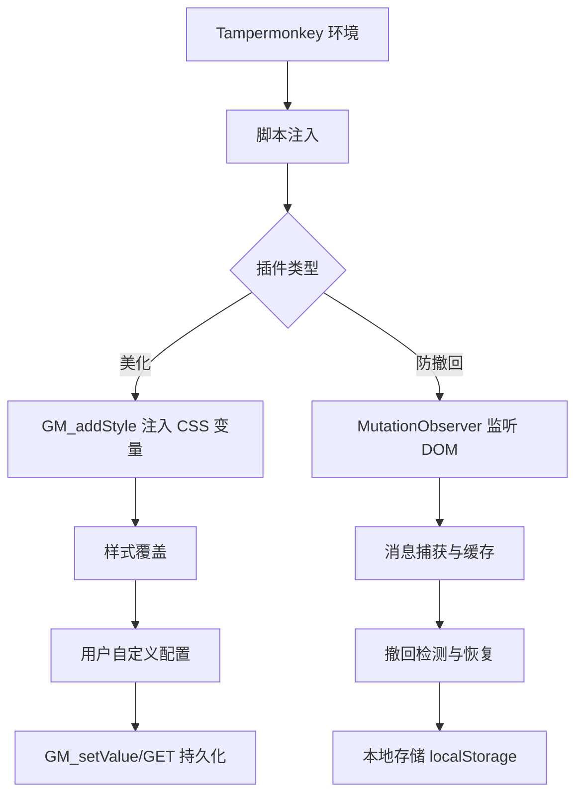

# DeepSeek Web Chat Enhancement Suite

> 为 DeepSeek Web Chat 量身打造的轻量级增强工具集，基于 Tampermonkey 实现，无需后端，即装即用。

---

## 目录

- [项目定位](#项目定位)
- [插件列表](#插件列表)
- [功能详解](#功能详解)
  - [DeepSeek 美化](#deepseek-美化)
  - [DeepSeek 防撤回](#deepseek-防撤回)
- [技术架构](#技术架构)
- [安装与使用](#安装与使用)
- [配置说明](#配置说明)
- [常见问题](#常见问题)
- [贡献与反馈](#贡献与反馈)
- [许可证](#许可证)

---

## 项目定位

DeepSeek Web Chat 提供了强大的对话能力，但在交互细节与数据持久性上仍有提升空间。本套件聚焦两个核心场景：

- **视觉优化** —— 让聊天界面更符合阅读习惯，减少视觉疲劳
- **消息保护** —— 避免因对方撤回导致的信息丢失，通过本地缓存实现“防撤回”

所有脚本均**纯前端运行**，不依赖任何外部服务，数据仅存储在用户本地，兼顾效率与隐私。

---

## 插件列表

| 插件名称 | 版本 | 核心功能 | 适用场景 |
|----------|------|----------|----------|
| DeepSeek 美化 | 11.0 | 自定义气泡样式、头像、间距 | 追求个性化阅读体验 |
| DeepSeek 防撤回 | 1.0 | 本地缓存消息，撤回后恢复显示 | 需要保留完整对话记录 |

---

## 功能详解

### DeepSeek 美化

**解决的问题**：原生界面消息样式单一，AI 与用户消息区分度不足，长时间阅读易疲劳。

**实现方案**：
- 通过 `GM_addStyle` 动态注入 CSS 变量，覆盖原生样式
- 支持独立控制 AI 消息、用户消息的**背景色、文字颜色、圆角、内边距、间距**
- 自动为两条消息添加 SVG 头像（AI 为deepseek_logo，用户为人形），增强视觉区分

**自定义能力**：
所有样式参数均可在脚本开头的 `DEF` 对象中调整，修改后刷新页面即生效，无需重装脚本。

---

### DeepSeek 防撤回

**解决的问题**：聊天中对方撤回消息后，内容会从界面上消失，但您可能仍需要查看或保存该信息。

**实现方案**：
- 使用 MutationObserver 监听 DOM 变化，实时捕获新出现的消息节点
- 将消息内容（文本、时间戳、发送者）序列化后存入 `localStorage`
- 当检测到“撤回”动作时，从缓存中读取对应消息并重新插入到 DOM 的原始位置

**技术要点**：
- 以消息唯一标识（如消息 ID 或时间戳组合）作为缓存键，避免重复存储
- 缓存采用 LRU 策略，自动清理超出容量（默认 500 条）的旧记录
- 恢复时保持消息顺序与原始时间线一致

**安全声明**：
所有数据仅保存在您浏览器的本地存储中，不会上传至任何服务器。清除浏览器缓存会同时清除这些记录。

---

## 技术架构

**依赖说明**：
- 两个脚本均独立运行，互不干扰
- 使用 Tampermonkey API（`GM_addStyle`, `GM_setValue`, `GM_getValue`）实现高级功能
- 兼容 Chrome / Firefox / Edge 等主流浏览器（需安装 Tampermonkey）

---

## 安装与使用

### 前置条件

- 安装 [Tampermonkey](https://www.tampermonkey.net/)（或 Violentmonkey、Greasemonkey）
- 确保已登录 DeepSeek Web Chat（[https://chat.deepseek.com/](https://chat.deepseek.com/)）

### 安装步骤

<b>方式一：一键安装（推荐）</b>

1. 访问本仓库的脚本目录（如 `deepseek美化/`）
2. 点击对应的 `.js` 文件
3. 点击页面上的 **Raw** 按钮
4. Tampermonkey 将自动弹出安装窗口，点击 **安装** 即可

<b>方式二：手动安装</b>

1. 打开 Tampermonkey 仪表盘，点击 **添加新脚本**
2. 将脚本源码完整复制并粘贴到编辑器中
3. 保存（Ctrl+S）后启用脚本

### 使用

- **美化脚本**：安装后打开 DeepSeek 聊天页面即自动生效。如需调整样式，修改 `DEF` 对象中的数值后刷新页面。
- **防撤回脚本**：安装后自动运行，无需任何操作。当消息被撤回时，会看到原消息重新出现，并带有一个 “[已恢复]” 标记（可选）。

---

## 配置说明

### 美化脚本配置参数

| 参数名 | 类型 | 默认值 | 说明 |
|--------|------|--------|------|
| `aiBg` | 颜色值 | `#007AFF` | AI 消息气泡背景色 |
| `userBg` | 颜色值 | `#07C160` | 用户消息气泡背景色 |
| `aiText` | 颜色值 | `#ffffff` | AI 消息文字颜色 |
| `userText` | 颜色值 | `#ffffff` | 用户消息文字颜色 |
| `thinkText` | 颜色值 | `''`（继承） | 思维链（thinking）区域的文字颜色，留空则使用默认 |
| `radius` | 数字（px） | `12` | 消息气泡圆角大小 |
| `padding` | 数字（px） | `14` | 消息气泡内边距 |
| `gap` | 数字（px） | `10` | 消息之间的垂直间距 |

### 防撤回脚本配置参数

| 参数名 | 类型 | 默认值 | 说明 |
|--------|------|--------|------|
| `MAX_CACHE` | 数字 | `500` | 最大缓存消息条数，超出后自动删除最早记录 |
| `SHOW_RESTORE_TAG` | 布尔 | `true` | 恢复消息时是否添加 “[已恢复]” 标记 |

---

## 常见问题

<b>脚本安装后没有生效？</b>

- 确认 Tampermonkey 已启用（图标为彩色而非灰色）
- 刷新 DeepSeek 聊天页面（按 F5）
- 检查浏览器控制台（F12）是否有报错信息，如有请提交 Issue

<b>美化脚本修改参数后没有变化？</b>

- 修改后必须刷新页面才能重新加载样式
- 确保修改的是 `DEF` 对象中的值，且语法正确（如颜色值带 `#`）

<b>防撤回脚本恢复的消息顺序错乱？</b>

- 脚本会依据消息发送时间戳进行排序，若 DeepSeek 页面本身不提供时间戳，则可能以 DOM 顺序为准。请尝试刷新页面重新加载缓存。

<b>缓存数据会占用多少空间？</b>

- 每条消息约占用 1~2KB，500 条约 1MB 以内，对浏览器性能无影响。

---

## 贡献与反馈

欢迎提交 Issue 和 Pull Request。

- **报告问题**：请在 [Issues](https://github.com/LaoBiDeng321/deepseek_web_chat_plugin_Tampermonkey/issues) 中描述复现步骤和浏览器环境
- **功能建议**：同样在 Issues 中提出，并标签为 `enhancement`
- **代码贡献**：Fork 本仓库，创建分支，提交 PR

---

## 许可证

本项目采用 [MIT 许可证](LICENSE)，允许自由使用、修改和分发，但需保留版权声明。

---

**最后更新**：2026-08-17  
**维护者**：[LaoBiDeng321](https://github.com/LaoBiDeng321)
